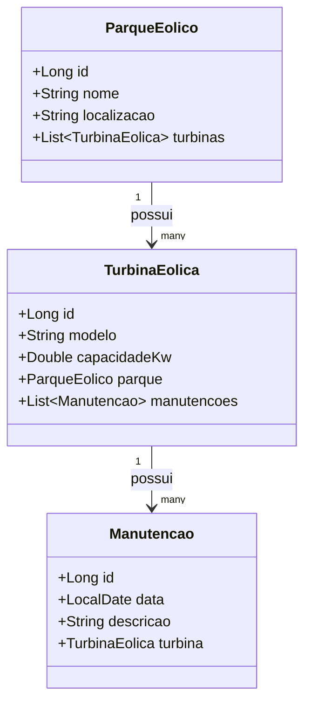

# 🌬️ Windpower API

API RESTful para gerenciamento de parques eólicos, desenvolvida com **Spring Boot 3**, **Java 17**, e **Railway** para deploy em nuvem.

---

## 🚀 Tecnologias usadas

- Java 17
- Spring Boot 3
- Spring Data JPA
- PostgreSQL (Railway)
- H2 (ambiente de desenvolvimento)
- OpenAPI/Swagger
- Maven

---

## 📁 Estrutura básica

- `src/main/java/.../models` → Entidades do sistema  
- `src/main/java/.../repositories` → Interfaces do Spring Data  
- `src/main/java/.../services` → Regras de negócio  
- `src/main/java/.../controllers` → Endpoints da API

---

## ⚙️ Como rodar localmente

# 1. Clone o repositório:

git clone https://github.com/deivid0304/windpower-api.git

# 2. Execute com Maven:

./mvnw spring-boot:run

# 3. Acesse o Swagger:

http://localhost:8080/swagger-ui.html

# ☁️ Deploy na nuvem
Deploy automático via Railway. Acesse a API em produção:

➡️ https://windpower-api.up.railway.app

# 📌 Funcionalidades da API

- Cadastro de turbinas eólicas

- Gerenciamento de parques eólicos

- Histórico de manutenções

- Integração com banco de dados PostgreSQL

- Documentação Swagger gerada automaticamente

